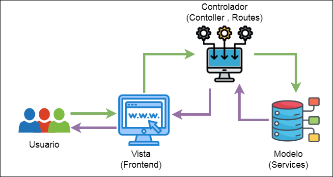

# a Clínica Fénix

## Integrantes

| Nombre | Carnet |
| ------ | ------ |
|  Diego Andres Huite Alvarez| 202003585 |
|  Jorge Sebastian Zamora Polanco | 202002591 |
|  Lesther Kevin Federico López Miculax  | 202110897 |
|  Hugo Daniel Giron Garcia| 202004807 |
|  Genesis Nahomi Aparicio Acan | 202113293  |

## Indice   
1. [Introducción](#1-introducción)
2. [Objetivos](#2-objetivos)
    1. [Objetivo General](#21-objetivo-general)
    2. [Objetivos Específicos](#22-objetivos-específicos)
3. [Core del Negocio](#3-CoredelNegocio)
3. [Requerimientos del Sistema](#3-RequerimientosdelSistema)
1. [Requerimientos Funcionales](#31-RequerimientosFuncionales)
    2. [Objetivos Específicos]
5. [Framework](#5-Framework)
6. [Patrón de Diseño](#6-PatróndeDiseño)

## 1. Introducción

## 2. Objetivos

## 2.1 Objetivo General
Desarrollar e implementar un sistema de gestión digital de expedientes médicos para la Clínica Fénix, que permita almacenar, organizar y acceder de manera rápida y segura a la información de los pacientes, optimizando el tiempo de atención y mejorando la eficiencia operativa, al reemplazar el uso de expedientes físicos por un sistema automatizado que facilite la gestión de citas, registros médicos, recetas y otros datos relevantes.
## 2.2 Objetivos Específicos

- Implementar un módulo de gestión de pacientes que permita el registro, modificación, eliminación y consulta de los datos personales de los pacientes, así como la visualización de su historial médico, citas y recetas, mejorando la eficiencia en la atención y el acceso a la información.

- Desarrollar un sistema de agendamiento y gestión de citas que valide automáticamente la disponibilidad de horarios y fechas, permitiendo a los pacientes agendar, modificar y cancelar citas de forma sencilla, y asegurando que el sistema no permita citas duplicadas ni en horarios no disponibles.

## 3. Core del Negocio

La Clínica Fénix es un centro de salud privado ubicado en la ciudad de Guatemala, reconocido por brindar tratamientos médicos de alta calidad durante décadas. Su actividad principal se centra en la atención integral a pacientes, abarcando consultas generales, seguimiento médico especializado y gestión de expedientes clínicos. La clínica opera bajo un modelo orientado a la excelencia en el servicio, priorizando la satisfacción del paciente y la eficiencia operativa.

### Servicios Clave:
- Registro y gestión de expedientes médicos físicos y digitales.

- Consultas médicas presenciales con especialistas.

- Programación de citas y seguimiento de historiales clínicos.

- Emisión de recetas médicas personalizadas.

### Problemática Actual:
El crecimiento en la demanda de servicios ha expuesto las limitaciones del sistema tradicional basado en expedientes físicos. Los principales desafíos incluyen:

- Acceso lento a información: Búsquedas manuales que generan retrasos en la atención.

- Riesgo de pérdida de datos: Documentación física vulnerable a daños o extravíos.

- Saturación administrativa: Colas prolongadas y dificultad para coordinar citas.

### Solución Propuesta:
La implementación de un Sistema de Gestión Digital de Expedientes Médicos busca transformar las operaciones de la clínica mediante:

- Digitalización centralizada: Almacenamiento seguro y accesible de datos de pacientes.

- Automatización de procesos: Agilización de citas, registros y actualizaciones de información.

- Integridad de datos: Reducción de errores humanos y garantía de disponibilidad 24/7.

Este sistema no solo optimizará la eficiencia interna, sino que también reforzará la reputación de la clínica al ofrecer una experiencia más ágil y confiable para pacientes y profesionales de la salud.

## 4. Requerimientos del Sistema

### 4.1 Requerimientos Funcionales

- **RF01**: El sistema debe permitir el registro de nuevos pacientes, solicitando los siguientes datos: nombre, apellido, CUI, teléfono, correo electrónico, edad, género y fecha de ingreso.
- **RF02**: El sistema debe permitir la modificación de los datos del paciente, como número de teléfono, correo electrónico o cualquier otra información básica que se haya registrado previamente.
- **RF03**:El sistema debe permitir la eliminación de un paciente y su expediente completo, incluyendo todas las citas asociadas al mismo.
- **RF03**:El sistema debe permitir a los doctores buscar y acceder al expediente completo de un paciente, utilizando su CUI o nombre completo.
- **RF04**:El sistema debe validar que la hora de la cita esté dentro del horario de atención de la clínica, que es de 7:00 AM a 7:00 PM.
- **RF05**:El expediente del paciente debe incluir la siguiente información:Datos personales básicos del paciente.
Historial de consultas anteriores,Citas futuras del paciente,Recetas médicas emitidas.
- **RF06**:El sistema debe permitir agendar una cita para un paciente, solicitando la siguiente información:CUI del paciente (debe estar registrado previamente),Fecha de la cita,Hora de la cita.
- **RF07**:El sistema debe validar que la fecha de la cita esté dentro de los días de atención de la clínica, que es de lunes a sábado.
- **RF08**:El sistema debe permitir modificar los datos de una cita ya agendada, como la fecha y hora.
- **RF09**: El sistema debe permitir la eliminación de una cita previamente agendada.
- **RF10**: El sistema debe permitir a los doctores generar recetas médicas, que incluyan los siguientes datos:Medicamento(s) prescrito(s),Dosis y frecuencia,Indicaciones especiales (si las hubiera),Firma digital del doctor.
- **RF11**: El sistema debe almacenar cada receta médica en el expediente del paciente para futuras referencias.
- **RF13**: El sistema debe evitar la creación de citas en horarios que ya estén ocupados por otro paciente.
- **RF14**: El sistema debe evitar que se agenden citas para fechas anteriores a la fecha actual.

### 4.2 Requerimientos No Funcionales

- **RF01**: El sistema debe garantizar la seguridad de los datos almacenados como los datos personales de los pacientes y las recetas médicas.
- **RF02**: El sistema debe ser accesible desde dispositivos con distintos tamaños de pantalla, asegurando que la interfaz sea adaptable a móviles y computadoras de escritorio.
- **RF03**: El sistema debe ser escalable, permitiendo la ampliación de funcionalidades y el aumento en el número de usuarios sin necesidad de realizar una reestructuración mayor.
- **RF04**:  Las recetas médicas generadas deben ser almacenadas de forma segura, permitiendo su acceso posterior únicamente a usuarios autorizados.
- **RF05**:El sistema debe ser compatible con los navegadores web más utilizados, como Chrome, Firefox, Safari y Edge, sin presentar fallos o dificultades en la visualización.
- **RF06**:El sistema debe ser capaz de manejar un número creciente de pacientes y expedientes.
- **RNF07**: La interfaz de usuario debe ser intuitiva y fácil de navegar, permitiendo a los usuarios realizar operaciones sin necesidad de asistencia técnica.
- **RNF08**: La interfaz de usuario debe ser intuitiva y fácil de navegar, permitiendo a los usuarios realizar operaciones sin necesidad de asistencia técnica.
- **RNF09**: Las operaciones de registrar paciente, generar receta  y agendar cita  deben completarse en un tiempo razonable.

## 5. Framework

## 6. Patrón de Diseño

### Patrón Utilizado: Modelo-Vista-Controlador (MVC)
La estructura del proyecto sigue el patrón de diseño Modelo-Vista-Controlador (MVC). Este patrón separa la aplicación en tres componentes principales, facilitando la organización del código, la mantenibilidad y la escalabilidad.

La división de las carpetas en la aplicación respeta lo siguiete del patron MVC:
- Modelo 
    - Representado por la carpeta de servicios `services`
    - Se encarga de gestionar la lógica de negocio y la comunicación con la base de datos
    - Implementa la gestión de los datos de los pacientes, garantizando que la aplicación pueda acceder y modificar la información de manera estructurada
- Vista 
    - Representada por la carpeta `Frontend`
    - La presentación de los datos se gestiona a través de una interfaz amigable
    - La comunicación entre la Vista y el Controlador se realiza mediante peticiones HTTP a la API REST.
- Controlador 
    - Ubicado en divido entre `controllers` y `routes`, maneja la lógica de la aplicación al recibir las solicitudes de la Vista y delegarlas al Modelo.
    - No contiene lógica de negocio, solo gestiona las solicitudes y respuestas.
    - `Routes` solo redirige cada petición HTTP al controlador correspondiente.

### Beneficios del Patrón MVC

- Separación de responsabilidades: Cada componente tiene un rol específico.

- Escalabilidad: Permite modificar o ampliar cada capa sin afectar las demás.

- Desarrollo paralelo: Frontend y backend pueden desarrollarse de manera independiente.

